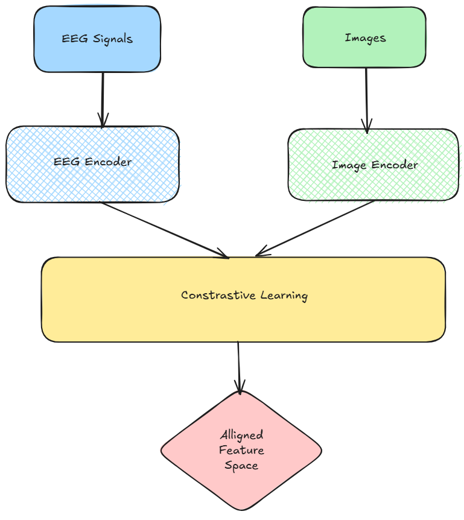
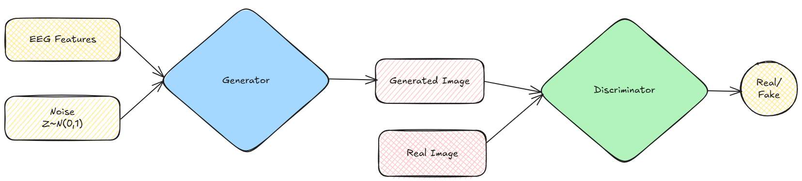
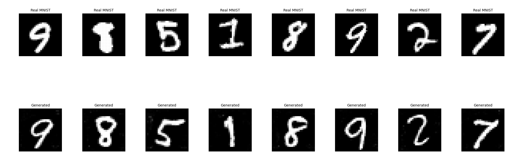
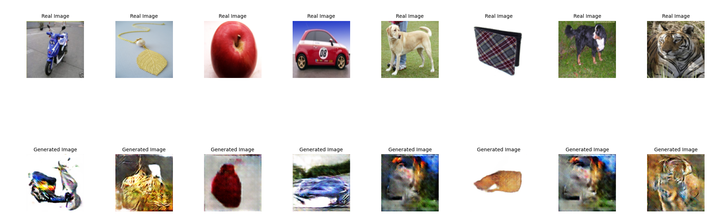
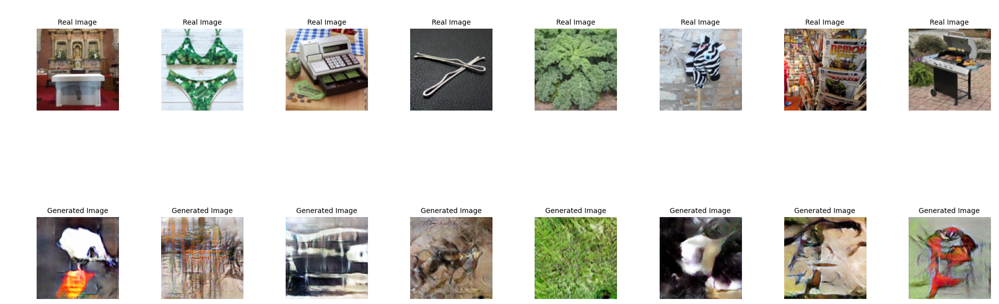

# GANDHI: Generative Adversarial Network for Decoding High-level Images from EEG signals

**GANDHI** combines Generative Adversarial Networks with contrastive learning to decode and reconstruct high-level visual content from EEG signals.

## Overview

The project implements a sophisticated pipeline that:
- **Encodes EEG signals** into feature representations using CNN-LSTM architectures
- **Aligns EEG and image features** through contrastive learning (InfoNCE and triplet loss)
- **Generates images** using a conditional GAN with spectral normalization

## Architecture

<p align="center">
  
</p>

<p align="center">
  
</p>


### Training Strategy

- **Phase 1**: Contrastive learning for EEG-image feature alignment
- **Phase 2**: Adversarial training with hinge loss and mode collapse prevention
- **Regularization**: Spectral normalization, dropout, and data augmentation

## Datasets

### 1. ThoughtViz Dataset
- **Source**: [ThoughtViz](https://github.com/ptirupat/ThoughtViz)
- **Content**: EEG recordings paired with MNIST digit and ImageNet images
- **Format**: Pickle files with preprocessed EEG data
- **Classes**: 10 classes

### 2. EEG_Image_decode Dataset
- **Source**: [EEG_Image_decode](https://github.com/dongyangli-del/EEG_Image_decode)
- **Content**: EEG recordings with natural image stimuli
- **Format**: NumPy arrays and image directories
- **Classes**: Multiple object categories from ImageNet

## Installation

### Setup

1. **Clone the repository**
```bash
git clone https://github.com/nihilisticneuralnet/GANDHI.git
cd GANDHI
```

2. **Install dependencies**
```bash
pip install -r requirements.txt
```

3. **Run the model**
```bash
cd src
python main.py
```


### Training Example

```python
from src.main import train_gan_with_mnist

# Train on ThoughtViz dataset
eeg_encoder, image_encoder, generator, discriminator = train_gan_with_mnist(
    eeg_pickle_path="data/thoughtviz/data.pkl",
    num_epochs=100,
    batch_size=64,
    lr=0.0002
)
```

## Results and Evaluation

## Outputs

- [ThoughtViz MNIST](https://github.com/ptirupat/ThoughtViz)


- [ThoughtViz ImageNet](https://github.com/ptirupat/ThoughtViz)



- [EEG_Image_decode](https://github.com/dongyangli-del/EEG_Image_decode)


### Metrics
- **Contrastive Alignment**: Cosine similarity between EEG and image features
- **Generation Quality**: FID (Fréchet Inception Distance) scores


## Technical Details

### Loss Functions

- **Contrastive Loss**: InfoNCE + Triplet Loss
- **Adversarial Loss**: Hinge loss for stable training
- **Feature Alignment Loss**: MSE between generated and real image features
- **Mode Seeking Loss**:  Prevents generator collapse and encourages output diversity

## References

- https://medarc-ai.github.io/mindeye/
- https://github.com/prajwalsingh/EEG2Image
- https://github.com/ptirupat/ThoughtViz
- https://github.com/dongyangli-del/EEG_Image_decode
